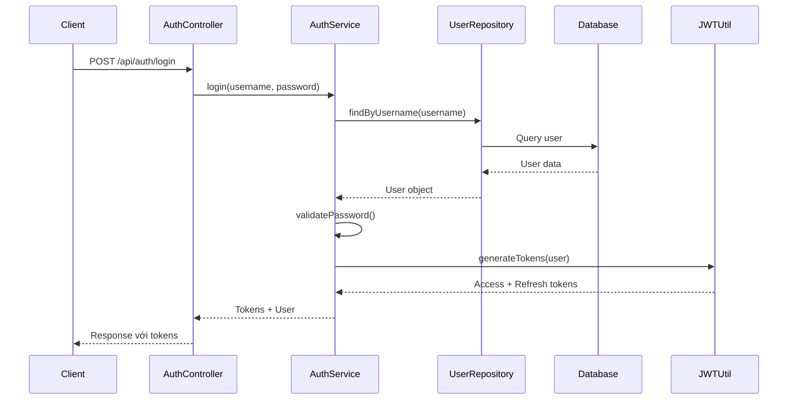
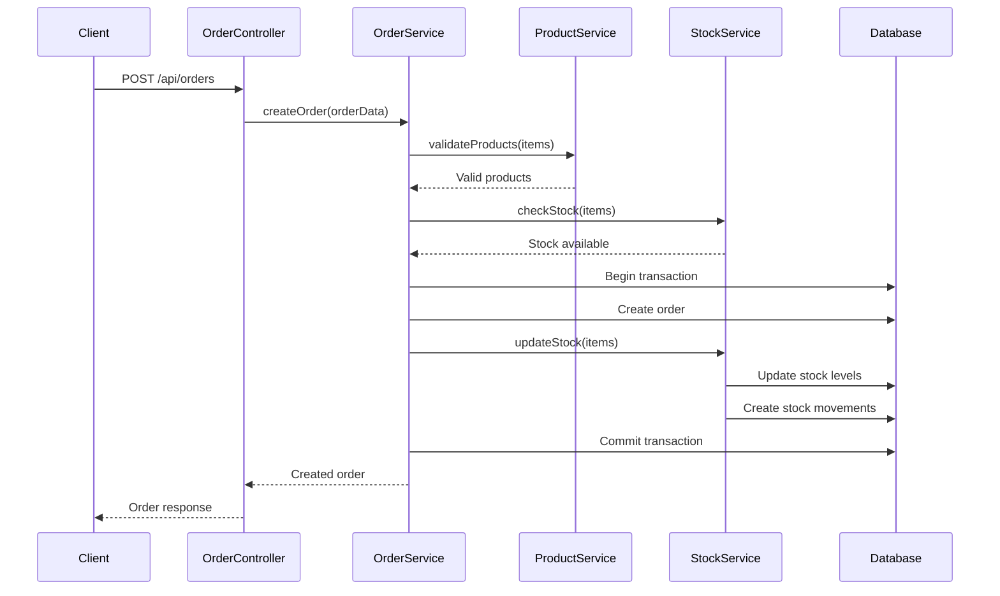

# 🏗️ Kiến trúc kỹ thuật POS API

## 📐 Tổng quan kiến trúc hệ thống

```
┌─────────────────────────────────────────────────────────────┐
│                    Lớp Frontend                             │
│  ┌─────────────────┐  ┌─────────────────┐  ┌──────────────┐ │
│  │   React App     │  │  Admin Panel    │  │ Mobile App   │ │
│  │   (Vite/TS)     │  │  (HBS/Tailwind) │  │ (Tương lai)  │ │
│  └─────────────────┘  └─────────────────┘  └──────────────┘ │
└─────────────────────────────────────────────────────────────┘
                              │
                    ┌─────────▼─────────┐
                    │   Load Balancer   │
                    │   (nginx/docker)  │
                    └─────────┬─────────┘
                              │
┌─────────────────────────────▼─────────────────────────────────┐
│                      Lớp API Gateway                         │
│  ┌─────────────────────────────────────────────────────────┐  │
│  │              Ứng dụng Express.js                       │  │
│  │  ┌─────────┐ ┌─────────┐ ┌─────────┐ ┌─────────┐       │  │
│  │  │  Auth   │ │Products │ │ Orders  │ │ Stock   │       │  │
│  │  │Routes   │ │ Routes  │ │ Routes  │ │ Routes  │       │  │
│  │  └─────────┘ └─────────┘ └─────────┘ └─────────┘       │  │
│  └─────────────────────────────────────────────────────────┘  │
└─────────────────────────────────────────────────────────────┘
                              │
┌─────────────────────────────▼─────────────────────────────────┐
│                    Lớp Middleware                            │
│  ┌─────────────┐ ┌─────────────┐ ┌─────────────┐             │
│  │    Auth     │ │ Validation  │ │Error Handler│             │
│  │ Middleware  │ │ Middleware  │ │ Middleware  │             │
│  └─────────────┘ └─────────────┘ └─────────────┘             │
└─────────────────────────────────────────────────────────────┘
                              │
┌─────────────────────────────▼─────────────────────────────────┐
│                   Lớp Controller                             │
│  ┌─────────────┐ ┌─────────────┐ ┌─────────────┐             │
│  │    Auth     │ │   Product   │ │    Order    │             │
│  │ Controller  │ │ Controller  │ │ Controller  │             │
│  └─────────────┘ └─────────────┘ └─────────────┘             │
└─────────────────────────────────────────────────────────────┘
                              │
┌─────────────────────────────▼─────────────────────────────────┐
│                    Lớp Service                               │
│  ┌─────────────┐ ┌─────────────┐ ┌─────────────┐             │
│  │    Auth     │ │   Product   │ │    Order    │             │
│  │   Service   │ │   Service   │ │   Service   │             │
│  └─────────────┘ └─────────────┘ └─────────────┘             │
└─────────────────────────────────────────────────────────────┘
                              │
┌─────────────────────────────▼─────────────────────────────────┐
│                  Lớp Repository                              │
│  ┌─────────────┐ ┌─────────────┐ ┌─────────────┐             │
│  │    User     │ │   Product   │ │    Order    │             │
│  │ Repository  │ │ Repository  │ │ Repository  │             │
│  └─────────────┘ └─────────────┘ └─────────────┘             │
└─────────────────────────────────────────────────────────────┘
                              │
┌─────────────────────────────▼─────────────────────────────────┐
│                   Lớp truy cập dữ liệu                       │
│  ┌─────────────────────────────────────────────────────────┐  │
│  │                Prisma ORM                               │  │
│  │  ┌─────────┐ ┌─────────┐ ┌─────────┐ ┌─────────┐       │  │
│  │  │  User   │ │Product  │ │ Order   │ │ Stock   │       │  │
│  │  │ Model   │ │ Model   │ │ Model   │ │Movement │       │  │
│  │  └─────────┘ └─────────┘ └─────────┘ └─────────┘       │  │
│  └─────────────────────────────────────────────────────────┘  │
└─────────────────────────────────────────────────────────────┘
                              │
┌─────────────────────────────▼─────────────────────────────────┐
│                    Lớp cơ sở dữ liệu                         │
│  ┌─────────────────────────────────────────────────────────┐  │
│  │              Cơ sở dữ liệu PostgreSQL                   │  │
│  │  ┌─────────┐ ┌─────────┐ ┌─────────┐ ┌─────────┐       │  │
│  │  │ users   │ │products │ │ orders  │ │stock_   │       │  │
│  │  │ table   │ │ table   │ │ table   │ │movements│       │  │
│  │  └─────────┘ └─────────┘ └─────────┘ └─────────┘       │  │
│  └─────────────────────────────────────────────────────────┘  │
└─────────────────────────────────────────────────────────────┘
```

## 🔧 Kiến trúc ngăn xếp công nghệ

### Framework cốt lõi
```typescript
// Express.js với TypeScript
Express.js 4.x
├── TypeScript 5.x (chế độ nghiêm ngặt)
├── ES Modules (type: "module")
├── Path mapping (@ aliases)
└── Hệ thống build: tsup
```

### Ngăn xếp cơ sở dữ liệu
```sql
PostgreSQL 16
├── Prisma ORM (truy vấn type-safe)
├── Connection pooling
├── Hệ thống migration
└── Quản lý dữ liệu seed
```

### Lớp bảo mật
```typescript
Ngăn xếp bảo mật
├── JWT (access + refresh tokens)
├── bcrypt (mã hóa mật khẩu)
├── express-validator (input validation)
├── helmet (security headers)
├── cors (cross-origin requests)
└── express-rate-limit
```

### Công cụ phát triển
```bash
Ngăn xếp phát triển
├── Docker (PostgreSQL container)
├── Swagger/OpenAPI (tài liệu API)
├── Winston (logging)
├── Vitest (testing)
├── ESLint + Prettier
└── GitHub Actions (CI/CD)
```

## 📁 Cấu trúc file chi tiết

```
pos-api/
├── src/
│   ├── config/                     # File cấu hình
│   │   ├── database.ts             # Thiết lập Prisma client
│   │   ├── environment.ts          # Biến môi trường
│   │   ├── swagger.ts              # Cấu hình OpenAPI
│   │   └── index.ts                # Barrel exports config
│   │
│   ├── types/                      # Định nghĩa kiểu TypeScript
│   │   ├── auth.types.ts           # Kiểu xác thực
│   │   ├── api.types.ts            # Kiểu API request/response
│   │   ├── database.types.ts       # Mở rộng mô hình cơ sở dữ liệu
│   │   └── index.ts                # Barrel exports kiểu
│   │
│   ├── utils/                      # Hàm tiện ích
│   │   ├── logger.ts               # Thiết lập Winston logger
│   │   ├── jwt.ts                  # Tiện ích JWT
│   │   ├── password.ts             # Mã hóa mật khẩu
│   │   ├── validation.ts           # Helper validation
│   │   ├── constants.ts            # Hằng số ứng dụng
│   │   └── helpers.ts              # Tiện ích chung
│   │
│   ├── middlewares/                # Express middlewares
│   │   ├── auth.middleware.ts      # Xác thực JWT
│   │   ├── role.middleware.ts      # Kiểm soát truy cập dựa trên vai trò
│   │   ├── validation.middleware.ts # Validation request
│   │   ├── error.middleware.ts     # Global error handler
│   │   ├── logging.middleware.ts   # Request logging
│   │   └── security.middleware.ts  # Security headers
│   │
│   ├── repositories/               # Lớp truy cập dữ liệu
│   │   ├── base.repository.ts      # Lớp repository cơ sở
│   │   ├── user.repository.ts      # Thao tác dữ liệu user
│   │   ├── product.repository.ts   # Thao tác dữ liệu product
│   │   ├── order.repository.ts     # Thao tác dữ liệu order
│   │   ├── stock.repository.ts     # Thao tác stock movement
│   │   └── index.ts                # Barrel exports repository
│   │
│   ├── services/                   # Lớp logic nghiệp vụ
│   │   ├── auth.service.ts         # Logic xác thực
│   │   ├── product.service.ts      # Quản lý sản phẩm
│   │   ├── order.service.ts        # Xử lý đơn hàng
│   │   ├── stock.service.ts        # Quản lý tồn kho
│   │   ├── email.service.ts        # Thông báo email
│   │   └── index.ts                # Barrel exports service
│   │
│   ├── controllers/                # Xử lý HTTP request
│   │   ├── auth.controller.ts      # Auth endpoints
│   │   ├── product.controller.ts   # Product endpoints
│   │   ├── order.controller.ts     # Order endpoints
│   │   ├── stock.controller.ts     # Stock endpoints
│   │   ├── admin.controller.ts     # Admin endpoints
│   │   └── health.controller.ts    # Health check
│   │
│   ├── routes/                     # Định nghĩa Express route
│   │   ├── auth.routes.ts          # Authentication routes
│   │   ├── product.routes.ts       # Product routes
│   │   ├── order.routes.ts         # Order routes
│   │   ├── stock.routes.ts         # Stock routes
│   │   ├── admin.routes.ts         # Admin routes
│   │   ├── web.routes.ts           # HBS preview routes
│   │   └── index.ts                # Tổng hợp route
│   │
│   ├── validators/                 # Schema validation đầu vào
│   │   ├── auth.validators.ts      # Quy tắc validation auth
│   │   ├── product.validators.ts   # Validation sản phẩm
│   │   ├── order.validators.ts     # Validation đơn hàng
│   │   └── common.validators.ts    # Validation chung
│   │
│   ├── views/                      # Templates Handlebars
│   │   ├── layouts/
│   │   │   ├── main.hbs           # Layout chính
│   │   │   └── admin.hbs          # Layout admin
│   │   ├── pages/
│   │   │   ├── dashboard.hbs      # Bảng điều khiển admin
│   │   │   ├── pos.hbs            # Giao diện POS
│   │   │   ├── products.hbs       # Quản lý sản phẩm
│   │   │   ├── orders.hbs         # Quản lý đơn hàng
│   │   │   └── login.hbs          # Trang đăng nhập
│   │   ├── partials/
│   │   │   ├── header.hbs         # Component header
│   │   │   ├── sidebar.hbs        # Điều hướng sidebar
│   │   │   ├── product-card.hbs   # Card sản phẩm
│   │   │   └── order-item.hbs     # Mục đơn hàng
│   │   └── helpers/
│   │       ├── formatters.ts      # Template helpers
│   │       └── index.ts           # Đăng ký helper
│   │
│   ├── public/                     # Tài nguyên tĩnh
│   │   ├── css/
│   │   │   ├── tailwind.css       # Tailwind output
│   │   │   └── custom.css         # Styles tùy chỉnh
│   │   ├── js/
│   │   │   ├── app.js             # Frontend JavaScript
│   │   │   ├── pos.js             # Chức năng POS
│   │   │   └── admin.js           # Chức năng admin
│   │   ├── images/
│   │   │   ├── logo.png           # Logo ứng dụng
│   │   │   └── products/          # Hình ảnh sản phẩm
│   │   └── icons/                 # Icons UI
│   │
│   ├── app.ts                      # Cấu hình Express app
│   └── server.ts                   # Entry point server
│
├── prisma/                         # Database configuration
│   ├── schema.prisma              # Database schema
│   ├── migrations/                # Database migrations
│   ├── seed.ts                    # Seed data script
│   └── seed-data/                 # Seed data files
│       ├── users.json
│       ├── products.json
│       └── categories.json
│
├── docker/                         # Docker configuration
│   ├── Dockerfile                 # Multi-stage build
│   ├── docker-compose.yml         # Development stack
│   ├── docker-compose.prod.yml    # Production stack
│   ├── nginx.conf                 # Nginx configuration
│   └── init-scripts/              # Database init scripts
│
├── docs/                          # Documentation
│   ├── api/                       # API documentation
│   │   ├── swagger.json          # OpenAPI spec
│   │   └── postman.json          # Postman collection
│   ├── deployment/                # Deployment guides
│   ├── development/               # Development setup
│   └── architecture/              # System architecture
│
├── tests/                         # Test files
│   ├── unit/                      # Unit tests
│   │   ├── services/
│   │   ├── controllers/
│   │   └── utils/
│   ├── integration/               # Integration tests
│   │   ├── auth.test.ts
│   │   ├── products.test.ts
│   │   └── orders.test.ts
│   ├── e2e/                       # End-to-end tests
│   ├── fixtures/                  # Test data
│   └── helpers/                   # Test utilities
│
├── scripts/                       # Build và deployment scripts
│   ├── build.sh                   # Production build
│   ├── deploy.sh                  # Deployment script
│   ├── backup.sh                  # Database backup
│   └── health-check.js            # Health check script
│
├── logs/                          # Application logs (gitignored)
├── uploads/                       # File uploads (gitignored)
├── coverage/                      # Test coverage (gitignored)
├── dist/                          # Build output (gitignored)
│
├── package.json                   # Dependencies và scripts
├── tsconfig.json                  # TypeScript configuration
├── tsup.config.ts                 # Build configuration
├── tailwind.config.js             # Tailwind CSS config
├── .env                           # Environment variables
├── .env.example                   # Environment template
├── .gitignore                     # Git ignore rules
├── .eslintrc.json                 # ESLint configuration
├── .prettierrc                    # Prettier configuration
├── vitest.config.ts               # Test configuration
├── docker-compose.yml             # Docker setup
└── README.md                      # Project documentation
```

## 🔄 Data Flow Architecture

### Authentication Flow


### Order Processing Flow


## 🛡️ Security Architecture

### JWT Token Strategy
```typescript
// Access Token (Short-lived: 15 minutes)
interface AccessTokenPayload {
  userId: string;
  username: string;
  role: UserRole;
  iat: number;
  exp: number;
}

// Refresh Token (Long-lived: 7 days)
interface RefreshTokenPayload {
  userId: string;
  tokenId: string;
  iat: number;
  exp: number;
}
```

### Role-Based Access Control
```typescript
enum UserRole {
  ADMIN = 'admin',
  CASHIER = 'cashier'
}

// Permission matrix
const Permissions = {
  [UserRole.ADMIN]: [
    'users:read', 'users:write', 'users:delete',
    'products:read', 'products:write', 'products:delete',
    'orders:read', 'orders:write', 'orders:delete',
    'stock:read', 'stock:write', 'stock:adjust',
    'reports:read', 'analytics:read'
  ],
  [UserRole.CASHIER]: [
    'products:read',
    'orders:read', 'orders:write',
    'stock:read'
  ]
};
```

### Input Validation Strategy
```typescript
// Multi-layer validation
1. Schema validation (express-validator)
2. Business logic validation (services)
3. Database constraints (Prisma)
4. Type safety (TypeScript)
```

## 📊 Performance Architecture

### Database Optimization
```sql
-- Optimized indexes
CREATE INDEX idx_products_name_search ON products USING gin(to_tsvector('english', name));
CREATE INDEX idx_orders_created_at ON orders (created_at DESC);
CREATE INDEX idx_order_items_order_id ON order_items (order_id);
CREATE INDEX idx_stock_movements_product_id ON stock_movements (product_id, created_at DESC);
```

### Caching Strategy
```typescript
// Response caching layers
1. Database query results (Redis - future)
2. Static assets (nginx/CDN)
3. API responses (conditional requests)
4. Template compilation (Handlebars cache)
```

### Monitoring Points
```typescript
// Key metrics to track
- API response times
- Database query performance
- Memory usage
- CPU utilization
- Error rates
- Authentication success/failure
- Business metrics (orders, revenue)
```

## 🔧 Build & Deployment Architecture

### Multi-stage Docker Build
```dockerfile
# Stage 1: Dependencies
FROM node:18-alpine AS deps
# Install dependencies

# Stage 2: Build
FROM node:18-alpine AS builder
# Build application

# Stage 3: Production
FROM node:18-alpine AS production
# Production runtime
```

### Environment Configuration
```typescript
// Environment-specific configs
Development: .env.development
Testing: .env.test
Staging: .env.staging
Production: .env.production
```

This architecture provides a solid foundation for a scalable, maintainable POS API system với modern best practices và comprehensive security measures.
